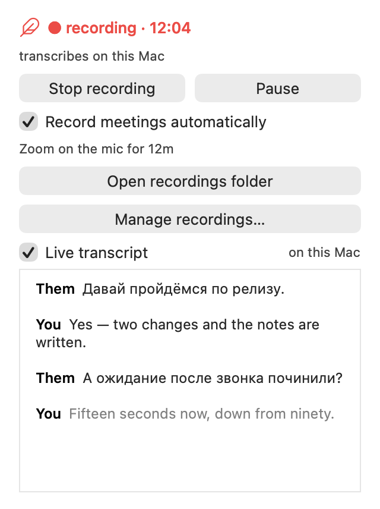
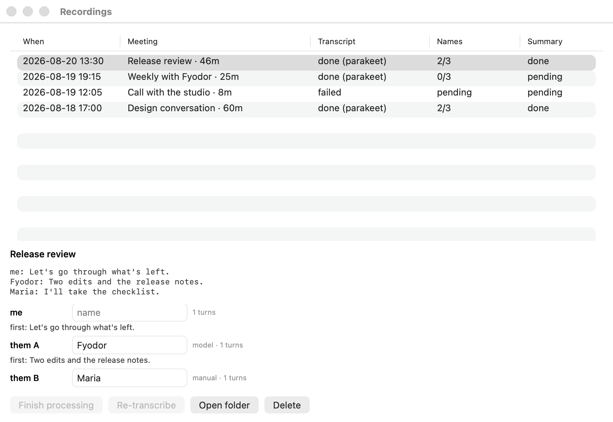

# Amanu

**Records and transcribes online meetings. Automatically.**

Amanu is a free, open-source meeting recorder for macOS. It works with Zoom,
Google Meet, Telegram, WhatsApp, and other call apps without sending a bot into
the meeting. It starts and stops recording on its own, separates speakers,
writes a detailed summary, and keeps the complete record in an ordinary folder
on your Mac.

[Website](https://amanu.me/) ·
[Download the latest release](https://github.com/gsamat/amanu/releases/latest) ·
[MIT license](LICENSE)

<picture>
  <source media="(prefers-color-scheme: dark)" srcset="landing/assets/shots/en/status-recording-dark.png">
  
</picture>

## What Amanu does

- **Records meetings automatically.** Amanu notices when a call app is using
  the microphone, adds context from the calendar when available, and stops when
  the call ends. Manual controls are always there too.
- **Produces a speaker-attributed transcript.** Your microphone and the other
  side of the call remain distinct, with diarization inside each side when the
  transcription engine supports it.
- **Puts names to voices.** Amanu uses calendar participants and evidence in the
  transcript, accepts a name only when confidence is high, and lets you correct
  the rest.
- **Writes a detailed summary.** The result covers the topic, key points,
  decisions, action items, and open questions. Amanu uses the models you choose
  instead of imposing a budget model of its own.
- **Shows its work.** The status window, menu bar, and Dock icon make it clear
  when a recording is running. An optional live transcript stays on the Mac.
- **Keeps one folder per meeting.** Audio, transcript, speaker names, summary,
  metadata, and processing logs are ordinary files that you own and can give
  to other tools.

## Local when you want it, powerful when you need it

Recording always happens on the Mac. Amanu can also transcribe and summarize a
meeting without sending its contents anywhere:

- Parakeet provides local transcription on Apple Silicon.
- The optional live transcript uses a separate on-device model.
- Ollama can write summaries locally.

Cloud models are available when quality or convenience matters more than
staying entirely offline. AssemblyAI and OpenAI can transcribe; Claude Code,
Codex, Anthropic, and OpenAI can write summaries. Within each model family,
Amanu prefers an existing CLI subscription to the corresponding metered API
key and falls through to the next configured backend when a subscription is
exhausted.

There is no Amanu account and no hosted meeting library. No meeting content
leaves the Mac unless you choose a cloud transcription or summary backend.
Work that cannot run without a network is marked as deferred and resumed later
instead of being silently dropped.

Anonymous product-usage reporting is enabled by default with a random install
UUID. The last control in first-run setup, and the same control in Settings,
turns it off. Recordings, transcripts, summaries, calendar contents, names,
paths, keys, and error text are never included. The complete event and field
list is public in [What Amanu sends](docs/analytics.md).

## What a meeting leaves behind

A typical retained session looks like this:

```text
~/Recordings/2026.09.02-1400 Weekly sync/
├── audio.m4a          # optional: microphone left, call audio right
├── transcript.md      # readable transcript with speaker names
├── transcript.json    # timed segments and engine provenance
├── speakers.json      # names, confidence, and supporting evidence
├── summary.md
├── meta.json          # timing, devices, trigger, and processing state
└── transcribe.log
```

Audio can be discarded automatically after a successful transcript. If
transcription fails, Amanu keeps the source recording so it can be tried again.
The recordings window shows what is complete, pending, or failed for every
session.

<picture>
  <source media="(prefers-color-scheme: dark)" srcset="landing/assets/shots/en/recordings-dark.png">
  
</picture>

## Why Amanu is built this way

The less visible parts of Amanu come from failures measured on real calls, not
from an idealized recording pipeline.

- **No bot, virtual audio device, or kernel extension.** A Core Audio process
  tap captures the call directly. That is why Amanu is not tied to a Zoom or
  Google Meet integration.
- **The two sides stay separate.** Amanu records the microphone and system
  audio independently, aligns them on one clock, and archives them as the left
  and right channels of one file. AssemblyAI receives the same separation as
  multichannel audio, so it does not have to guess which side a voice came
  from by loudness alone.
- **Recording must not change the meeting.** Apple's duplex voice-processing
  route can attenuate or interrupt playback merely because recording started.
  Amanu therefore captures the microphone raw by default and removes proven
  acoustic echo during transcript processing, where it cannot affect the call.
- **Capture is crash-recoverable.** The live tracks are uncompressed PCM in
  CAF containers and are compressed only after the transcript exists. A hard
  kill can leave an unfinished AAC file unreadable; PCM preserves everything
  written before the interruption. On the next launch, Amanu adopts the
  interrupted session and puts it back into the normal processing queue.
- **The folder is the database.** `meta.json` and the artifacts beside it are
  the source of truth. There is no separate library to corrupt or migrate, and
  the app and CLI claim work before processing so they cannot both upload the
  same recording.
- **It is a signed application, not a background executable pretending to be
  one.** macOS grants microphone and system-audio access to the responsible app
  and its code signature. Amanu ships as a Developer ID-signed, hardened, and
  notarized bundle so those permissions survive updates.
- **Updates wait for the recording.** Sparkle checks and installs signed
  releases, but an update never quits Amanu in the middle of a meeting.
- **Failures become tests.** The automated suite covers interrupted sessions,
  silent or stalled tracks, route changes, sample-rate mismatches, concurrent
  processing, transcription fallbacks, and UI regressions. A separate window
  harness renders the main screens in English and Russian, in light and dark
  appearances.

The constraints behind these choices are documented in
[Things that will bite](docs/pitfalls.md). Design notes live in
[`docs/specs`](docs/specs/).

## Install

Download the disk image from the
[latest release](https://github.com/gsamat/amanu/releases/latest), drag
`Amanu.app` to Applications, and open it. The first-run setup requests
microphone, system-audio, and optional calendar access, then asks how meetings
should be transcribed and summarized.

Requirements:

- macOS 15 or later.
- Apple Silicon for local transcription and the live transcript.
- The distributed app is universal (`arm64` and `x86_64`). On Intel, recording
  and cloud transcription paths are available, but the app has not yet been
  validated on physical Intel hardware. See [Old Macs](docs/old-macs.md) for
  the measured boundaries.

The release is signed with a Developer ID certificate and carries a stapled
Apple notarization ticket. Amanu checks for signed updates automatically and
will not install one during a recording.

## Build from source

Amanu is one Swift 6 package. SwiftPM builds the executable; `make app`
assembles and signs the application bundle without an Xcode project.

```sh
git clone https://github.com/gsamat/amanu.git
cd amanu
make app
make run-app
swift test
```

`make run-app` launches through LaunchServices, which matters because macOS
attributes privacy permissions to the process responsible for starting the
capture. A checkout with no signing certificate falls back to ad-hoc signing;
that is sufficient for development, although macOS may ask for permissions
again after a rebuild.

Before changing capture, packaging, permissions, or releases, read
[`CLAUDE.md`](CLAUDE.md), [Things that will bite](docs/pitfalls.md), and
[Releasing](docs/releasing.md).

## CLI

First launch creates `~/.local/bin/amanu`, pointing into the installed app so
scripts use the same signed program as the UI.

```sh
amanu doctor                 # check permissions, engines, and configuration
amanu record start           # ask the running app to start recording
amanu record stop
amanu sessions               # list recordings and outstanding work
amanu process <folder>       # finish or retry one meeting
amanu setup                  # reopen first-run setup
```

Run `amanu --help` or `amanu <command> --help` for the complete command-line
interface. Most people never need it: recording and post-processing are
automatic, and the app exposes the same controls.

## Configuration

Settings writes `~/.config/amanu/config.json`. The file is optional, and a
control returned to its default is removed rather than frozen there. A compact
example:

```json
{
  "recordings_dir": "~/Recordings",
  "keep_audio": false,
  "analytics": true,
  "interface_language": "auto",
  "transcription": {
    "enabled": true,
    "engine": "auto",
    "cloud": "assemblyai",
    "language": "ru",
    "assemblyai": { "api_key_path": "~/.config/amanu/keys/assemblyai" }
  },
  "auto_record": {
    "enabled": true,
    "mic_activity": true,
    "calendar": false,
    "start_delay_seconds": 12,
    "stop_delay_seconds": 15,
    "min_duration_seconds": 45,
    "silence_stop_minutes": 10,
    "max_duration_minutes": 300,
    "apps": ["us.zoom", "com.google.Chrome"],
    "ignore_apps": []
  },
  "summary": {
    "enabled": true,
    "backend": "auto",
    "language": "ru"
  },
  "on_stop": "my-hook"
}
```

- `recordings_dir` selects the session folder; `keep_audio` retains the compact
  stereo archive after a successful transcript; `on_stop` is a shell command
  run after processing; `analytics` controls anonymous product-usage reporting.
- `transcription.*` covers `enabled`, `engine`, `cloud`, `model`, and `language`.
  Provider overrides are `transcription.openai.model`,
  `transcription.assemblyai.api_key`,
  `transcription.assemblyai.api_key_path`, and
  `transcription.assemblyai.speech_model`. `live_transcription.enabled`
  controls the on-device preview.
- `auto_record.*` covers `enabled`, `mic_activity`, `calendar`,
  `start_delay_seconds`, `stop_delay_seconds`, `min_duration_seconds`,
  `max_duration_minutes`, `silence_stop_minutes`, `apps`, and `ignore_apps`.
- `speaker_names.*` covers `enabled`, `backend`, and `model`.
- `summary.*` covers `enabled`, `backend`, `language`, `model`,
  `openai_model`, `ollama_model`, `api_key_path`, and `openai_api_key_path`.
- `mic_voice_processing` enables Apple's capture-time voice processing;
  `transcript_echo_filter` removes proven duplicate far-end speech later;
  `system_audio` is `app` or `all`; `calendar` controls meeting context; and
  `user_name` replaces “me” in named transcripts.
- `interface_language` is `auto`, `en`, or `ru`. `dock_icon`, `menu_bar_icon`,
  and `window` control where Amanu appears.

Inline and file-based API keys remain supported for compatibility, but the UI
never displays an inline secret. Environment variables take precedence.

## Project

Amanu began as a fork of [digimata/quill](https://github.com/digimata/quill)
and has since been substantially rewritten. The fork grew into a native app
with first-run setup, automatic recording, live transcription, speaker naming,
a resumable processing pipeline, local and cloud backends, crash recovery, a
regression suite, and signed automatic updates. [FORK.md](FORK.md) gives the
complete comparison and explains why each change was made.

The name comes from *amanuensis*: a person whose job is to write down what is
said. Amanu is free software under the [MIT license](LICENSE).
